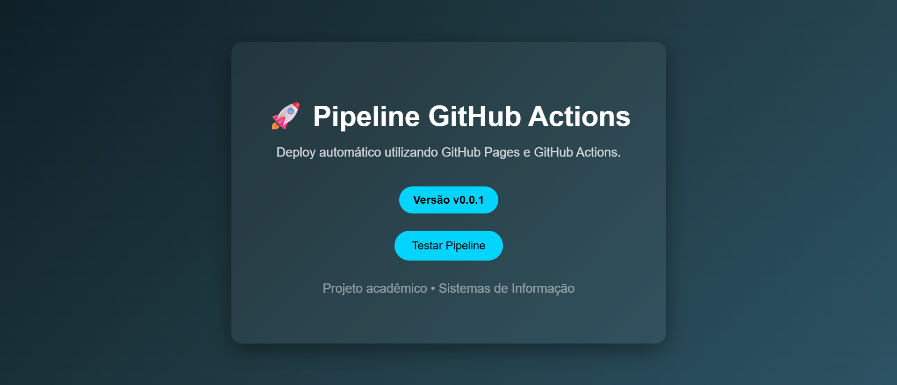

# 🚀 Pipeline de Releases com GitHub Actions


Projeto demonstrando pipeline de deploy automático com GitHub Actions e GitHub Pages.

# 🚀 Pipeline de Releases com GitHub Actions

Este projeto demonstra a criação de um **pipeline de releases utilizando GitHub Actions**, com publicação automática de uma página estática utilizando **GitHub Pages**.

A cada nova versão criada através de **tags**, o pipeline executa automaticamente e realiza o **deploy da aplicação**.

---

## 📌 Objetivo

O objetivo deste projeto é demonstrar na prática:

* Criação de repositório no GitHub
* Versionamento utilizando **Git**
* Criação de **tags de versão**
* Automação de deploy com **GitHub Actions**
* Publicação de página estática com **GitHub Pages**

---

## 📸 Preview do Projeto



## ⚙️ Tecnologias utilizadas

* HTML5
* Git
* GitHub
* GitHub Actions
* GitHub Pages

---

## 📂 Estrutura do Projeto

```
pipeline-releases
│
├── index.html
│
└── .github
     └── workflows
          └── static.yml
```

---

## 🔄 Pipeline de Deploy

O pipeline é executado automaticamente sempre que uma **nova tag de versão** é enviada para o repositório.

Fluxo do processo:

1. Desenvolvedor cria ou altera arquivos localmente
2. Realiza commit das alterações
3. Cria uma **tag de versão**
4. Envia a tag para o GitHub
5. O **GitHub Actions executa o workflow**
6. O site é publicado automaticamente no **GitHub Pages**

---

## 🏷️ Criando uma nova versão

Para gerar uma nova release:

```bash
git tag v0.0.1
git push --tags
```

Após isso, o **GitHub Actions executará o pipeline automaticamente.**

---

## 🌐 Acesso ao projeto publicado

O site pode ser acessado através do GitHub Pages:

```
https://rpsroberto.github.io/pipeline-releases/
```

---

## 👨‍💻 Autor

Projeto desenvolvido por **Roberto Pereira**
Estudante de **Sistemas de Informação**

---

## 📚 Contexto Acadêmico

Atividade desenvolvida na disciplina de **Gerência de Configuração e Dependência**, com o objetivo de aplicar conceitos de **versionamento, automação de pipeline e deploy contínuo**.
